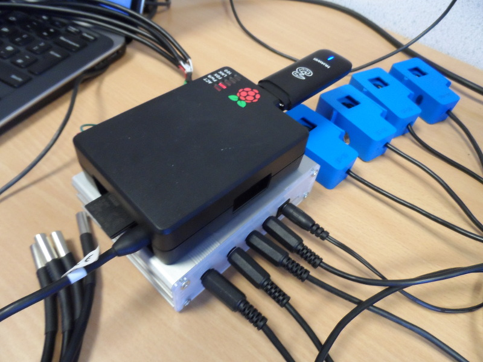
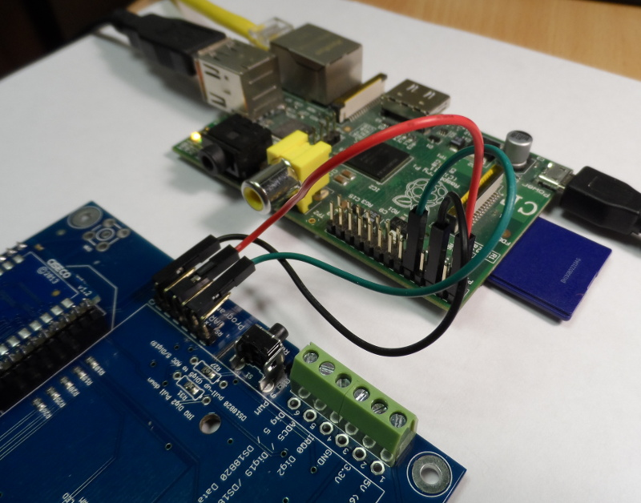

# Archived

## Heatpump Monitor (Direct serial EmonTx to RPi + GSM)

The following guide documents how to build a heatpump monitoring system with:

- 4x DS18B20 Temperature sensors
- 3x CT current sensors
- 1x AC Voltage measurement for real power and powerfactor measurement.
- [A direct wired serial connection between the emontx and the raspberrypi](http://openenergymonitor.org/emon/node/3884)
- Buffering of data on the Raspberry PI if the internet connection goes down.
- Support of GSM connectivity using Huawei e3231 usb dongle

## Setting up the system

### 1) Upload the EmonTx firmware

Upload the following heatpump specific application firmware using a USB to UART programmer to the emontx:

[https://github.com/openenergymonitor/emonTxFirmware/blob/master/emonTxV3/RFM12B/Examples/HeatpumpMonitorSerial/HeatpumpMonitorSerial.ino](https://github.com/openenergymonitor/emonTxFirmware/blob/master/emonTxV3/RFM12B/Examples/HeatpumpMonitorSerial/HeatpumpMonitorSerial.ino)

### 2) Connect the EmonTx to the raspberryPI

This can be done by using 3 jumper wires as documented here: [Connect an EmonTx v3 to RaspberryPI via serial](http://openenergymonitor.org/emon/node/3884)

### 3) Setting up the Raspberrypi

**[How to: setup a raspberrypi gateway for sending data to emoncms.org (node only mode)](../../Modules/RaspberryPI/Gateway/gateway.md)**
_Uses emonhub to forward data directly to emoncms.org without decoding on the raspberrypi_

Ready to go image:
[http://217.9.195.228/2014-05-19-emonhub-gateway.img.zip](http://217.9.195.228/2014-05-19-emonhub-gateway.img.zip)

### 4) Add GSM Connectivity support

I followed the techmind guide which worked well with the Huawei e3231 which operates as a 'HiLink' modem: [http://www.techmind.org/rpi](http://www.techmind.org/rpi)

The main steps in the event that the techmind guide is not available are:

1) Install sg3-utils:

    sudo apt-get install sg3-utils

2) After restarting the raspberrypi, the usb dongle will likely need to be placed in the correct mode:

    sudo /usr/bin/sg_raw /dev/sr0 11 06 20 00 00 00 00 00 01 00

3) To automate this step so that the pi always boots up into the correct mode.

Create the following file:

    sudo nano /etc/udev/rules.d/10-Huawei.rules

copy and paste this line in to it.

    SUBSYSTEMS=="usb", ATTRS{modalias}=="usb:v12D1p1F01*", SYMLINK+="hwcdrom", RUN+="/usr/bin/sg_raw /dev/hwcdrom 11 06 20 00 00 00 00 00 01 00"

Open the network interfaces file to edit:

    sudo nano /etc/network/interfaces

and add the following lines:

    allow-hotplug eth1
    iface eth1 inet dhcp

Complete the setup by rebooting the pi:

    sudo reboot

_For debugging: typing the command lsusb is useful, the Huawei Technologies entry should be in mode: 12d1:14db not 12d1:1f01_

## Using the heatpump monitor

The best place to start with making use of your heatpump monitor is to understand exactly how a heatpump works, when it is most efficient, so that you can compare a theoretical understanding with the data being generated from your heatpump monitor.

John Cantor's book on heatpumps has several useful chapters on a heatpump's operation that I (Trystan) would highly recommend, here's his website: [http://heatpumps.co.uk/](http://heatpumps.co.uk/)

We're currently working on tools that model a heatpumps operation theoretically, making it possible to explore how different heating profiles and external and internal conditions affect its operation:

Theory: [Heatpump model](http://openenergymonitor.org/emon/node/3021)

Web App: [http://www.emoncms.org/openbem/heatpumpexplorer](http://www.emoncms.org/openbem/heatpumpexplorer)

If you build a heatpump monitor and can add your experience to this documentation please get in contact on the forums.

## Further development

- Allow for segmented upload of buffered data so that the raspberrypi doesn't try to post too much data at once overloading the server, data should also be transferred in the body of the request rather than the url.

- Check and test different mobile networks. Is it possible to get an unlocked version of the Huawei e3231 that a SIM card for each network can be inserted into so that the best network can be chosen for any particular site.

- Work out the typical data use for a day's logging, is it within a £10/month contract.

- Create a raspberrypi SD card image that has the GSM configuration ready to go.

## Initial data use tests

    **20:09 17th March 2014**
    Download  24.06 KB  2.66 MB
    Upload  16.51 KB  2.35 MB
    Total  40.56 KB  5.02 MB
    Duration  00:03:57  23:06:22
    
    **10:23 18th March 2014**
    Download  5.87 KB  4.78 MB
    Upload  3.69 KB  5.31 MB
    Total  9.56 KB  10.09 MB
    Duration  00:00:24  37:16:58
    
    **14h 15mins**
    dn 2.12 0.15 mb/h 108mb/month
    up 2.96 0.21 mb/h 151.2mb/month
