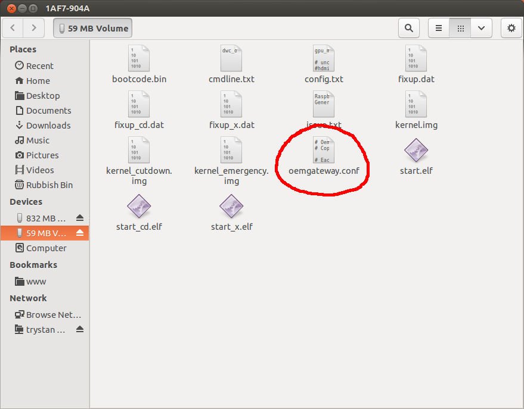
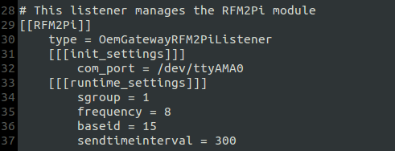
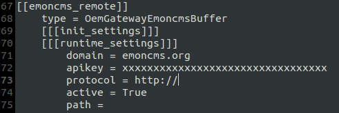
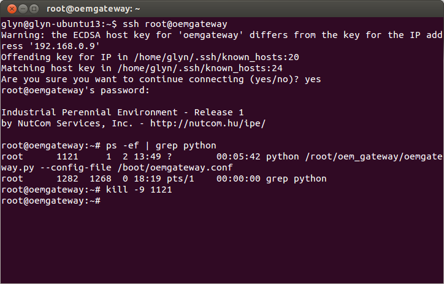
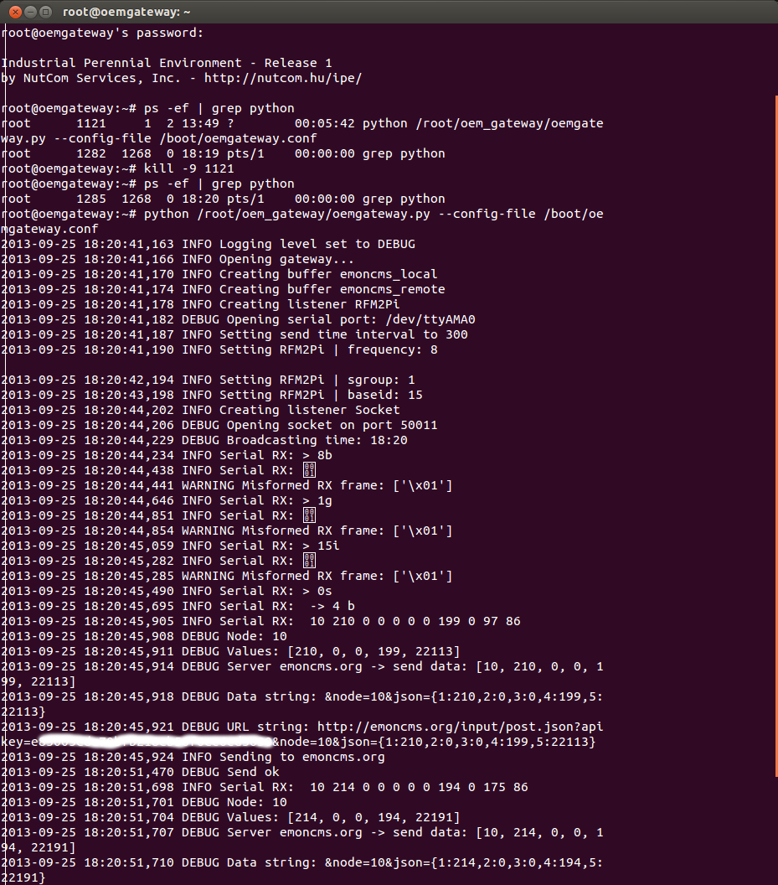

# Raspberry Pi Gateway

This is a reliable solution which is simple to setup and works well to forward data directly to a remote emoncms server like [emoncms.org](http://emoncms.org).

It uses a read-only file system approach which means its not susceptible to SD Card failure from too many writes:

#### If you have bought the [pre-loaded SD card](http://shop.openenergymonitor.com/pre-loaded-raspberry-pi-base-station-gateway-sd-card/) from the OpenEnergyMonitor shop jump stright to step 3) 

Background Info:

[http://harizanov.com/2013/08/rock-solid-rfm2pi-gateway-solution/](http://harizanov.com/2013/08/rock-solid-rfm2pi-gateway-solution/)

It uses Jerome Lafréchoux's exellent python oem_gateway to forward the data to emoncms.org, or other remote server.

[https://github.com/Jerome-github/oem_gateway](https://github.com/Jerome-github/oem_gateway)

<b>Note for use with older rfm12pi v1: </b>If your using the older through hole rfm12pi v1 and you dont need to send the time to an emonglcd it is advisable to turn off time sending in the oem_gateway.conf configuration file. To do this set sendtimeinterval = 0 on line 37 of  oem_gateway.conf. The ATTiny implementation of software serial has a bug in it that causes rfm12pi v1 time sending to be unreliable. rfm12pi v2 appears to work fine.

## 1) Download the ready-to-go SD card image:

Download pre-prepared 2GB SD card image:

#### Latest - oem_gateway22oct2013.img.zip (527Mb) 
**[includes updated firmware for new RAM chip (also works fine with Pi's with older RAM)](http://openenergymonitor.blogspot.com/2013/10/raspberry-pi-new-type-of-ram.html)**

[Mirror 1 - GoogleDrive](https://docs.google.com/file/d/0B7G0lHyW4GQbY2hnSGk4T0xGMlk/edit?usp=sharing)

[Mirror 2 - DropBox](https://www.dropbox.com/l/iTKAMBEqCk9XuntdZUaGed)

[Mirror 3 - UK Server ](http://217.9.195.228/oem_gateway22oct2013.img.zip)

[Mirror 4 - Europe Server](http://peppes-pizza.dk/oem/oem_gateway22oct2013.img.zip) 

[Mirror 5 - USA Server](http://oem.aluminumalloyboats.com/oem/oem_gateway22oct2013.img.zip) 

This image will unzip to fit on a 2GB SD card (min).
 
*Please get in contact if you can help with hosting bandwidth or seeding a torrent for these image downloads. Any help is much appreciated.*

## 1a) Alternatively build it yourself:

[http://emoncms.org/site/docs/raspberrypigatewaybuild](http://emoncms.org/site/docs/raspberrypigatewaybuild)

## 2) Write the image to an SD card

### Linux

Start by inserting your SD card, your distribution should mount it automatically so the first step is to unmount the SD card and make a note of the SD card device name, to view mounted disks and partitions run:

    $ df -h

You should see something like this:

    Filesystem            Size  Used Avail Use% Mounted on
    /dev/sda6             120G   90G   24G  79% /
    none                  490M  700K  490M   1% /dev
    none                  497M  1.7M  495M   1% /dev/shm
    none                  497M  260K  497M   1% /var/run
    none                  497M     0  497M   0% /var/lock
    /dev/sdb1             3.7G  4.0K  3.7G   1% /media/sandisk

Unmount the SD card, change sdb to match your SD card drive:

    $ umount /dev/sdb1 

If the card has more than one partition unmount that also: 

    $ umount /dev/sdb2

Locate the directory of your downloaded emoncms image in terminal and write it to an SD card using linux tool *dd*:

<i class='icon-fire'></i> <b>Warning:</b> take care with running the following command that your pointing at the right drive! If you point at your computer drive you could lose your data!

    $ sudo dd bs=4M if=raspberrypi_gateway.img of=/dev/sdb

### Windows 

The main raspberry pi sd card setup guide recommends Win32DiskImager, see steps for windows here: 
[http://elinux.org/RPi_Easy_SD_Card_Setup](http://elinux.org/RPi_Easy_SD_Card_Setup)
Select the image as downloaded above.

### Mac OSX 

See steps for Mac OSX as documented on the main raspberry pi sd card setup guide:
[http://elinux.org/RPi_Easy_SD_Card_Setup](http://elinux.org/RPi_Easy_SD_Card_Setup)
Select the image as downloaded above.
  

## 3) Configure oemgateway settings in SD Card 59Mb FAT boot partition

Insert the SD card into your laptop / SD card reader, open *oemgateway.conf* found in the SD Card boot partition in a plain text editor (e.g. gedit, notepad etc.):

Mac OSX

To see the boot partition on a Mac you will need to install the following software: OSXFuse [http://osxfuse.github.io](http://osxfuse.github.io) .  
This gives the Mac the ability to read and write to other filesystems, and and fuse-ext2 [http://sourceforge.net/projects/fuse-ext2](http://sourceforge.net/projects/fuse-ext2/) which includes the linux files sytem the card is now in.
After installing the drive will appear on your desktop allowing you to view an equivalent window to the one above.

The first part to configure is the group and frequency of the rfm12pi.
The group and frequency set here needs to be the same as used on any sensor nodes. For best range performance the frequency should match the RF hardware module. 

**The default network group for all units from the OpenEnergyMonitor shop is 210**

For the frequency setting: 8 used as shorthand for 868Mhz and 4 for 433Mhz. 

The second part to add the Read & Write APIKEY of your emoncms remote server account. If your using [http://emoncms.org](http://emoncms.org) that's all you need to add here, once you've created an account on emoncms.org your Read & Write APIKEY can be found under inputs > input API helper. 

If your posting to another emoncms server you will need to set the domain and you may need to set the path if the emoncms installation is in a sub-directory e.g. /emoncms

Save oemgateway.conf file, safely remove the SD card from your computer and now insert it into your Raspberry Pi.

## 4) Plug in the RFM12Pi Expansion module

Plug the RFM12Pi hardware expansion module onto the Pi's GPIO pins taking care to align up pin 1, the RFM12Pi should be connected to the GPIO pins connector closest to the edge of the pi. 

It's best to plug in the RFM12Pi before you power up the Pi, as the Pi sends configuration settings to the RFM12Pi on bootup.

## 5) Power it up!

That's it, if you have sensor nodes sending data, inputs should start appearing in the inputs section your emoncms account in a few seconds.

Return to the OpenEnergyMonitor Guide to setup your sensor nodes and map the inputs to create feeds and build your dashboard in emoncms: 
[http://openenergymonitor.org/emon/guide](http://openenergymonitor.org/emon/guide)

## Recommended Steps

We recomend you change the default password for the Pi. To do this we need to take control of the Pi over SSH. The are many tutorials on how to SSH into a pi on the interent, here we will assume you are using a linux terminal. The default username and password is 'root' and root':

	$ ssh root@oemgateway
	password: root 

The hostname 'oemgateway' usually works on most network configuritions, if you have trouble connecting try the Pi's local IP address (obtained from your router) instead. Once logged in the first recomended step is to change the password:

	$ passwd 

and set your timezone, the default is UTC. This will ensure that the emonGLCD display displayes the correct time and resets it's kWh/d counters at the correct time. Since this is a read only file system we need to temporary make it read/write then lock it back to read only once we're done: 
	
	$ ipe-rw
	$ dpkg-reconfigure tzdata
	$ ipe-ro

To enlarge the image to fill the SD card run

	$ firstboot

## Troubleshooting 

The first point of call for troubleshooting is to view the output of the python oem_gateway script. This is set to run at boot as a background task. To view the output of the script we first need to kill it:

	$ ps -ef | grep python

will return something like this:

We are looking for the process ID of the python script (PID) in my case this is '1121'. 

We can now kill this process with the line, replacing xxxx with the PID of your python script process:

	$ kill -9 xxxx

To restart the script as a foreground process so we can view it's output run 

	$ python /root/oem_gateway/oemgateway.py --config-file /boot/oemgateway.conf

If you want to save the log output to a file this can be done by running:

	$ python/root/oem_gateway/oemgateway.py --config-file /boot/oemgateway.conf --logfile /root/oem_gateway/oemgateway.log

You should now see output like the following:

"DEBUG Serial Rx: " followed by a string of numbers means data has been received from another node, this should be followed by

"DEBUG Node: 10" this means data has been received from Node with ID 10 (by default this is an emonTx), see bottom of [this page](http://openenergymonitor.org/emon/buildingblocks/rfm12b2) for default node ID allocation

"DEBUG Send ok" means the data has been succesfully posted to emoncms

To stop the script hit [CTRL + C]

To restart the script as a background process it's easiest just to reboot the Pi

	$ sudo reboot

If you wish to change any files on the Pi you will need to mount the storage as read and write. To do this run:
	
	$ ipe-rw

after your done you can revert the file system back to read only with

	$ ipe-ro

