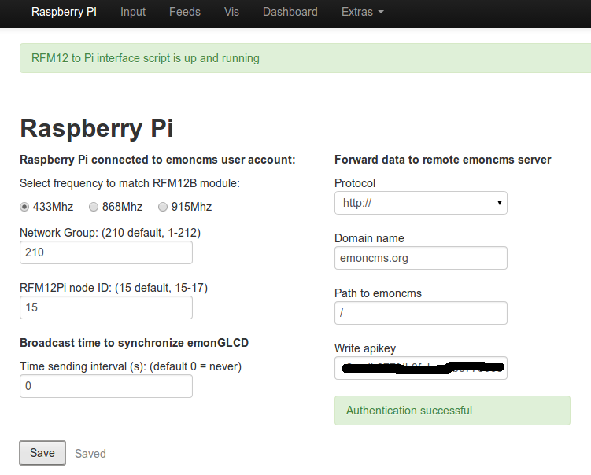
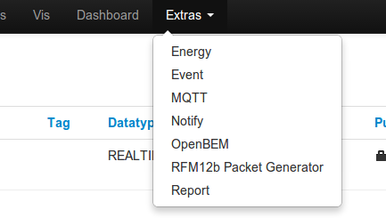

### Archived

Replaced with [https://github.com/emoncms/emoncms/tree/bufferedwrite](https://github.com/emoncms/emoncms/tree/bufferedwrite) which although aimed at SD cards can also be used with a harddrive with only a small change, see documentation linked from the page above.

### Raspberry Pi + Harddrive + Emoncms

[Image Build notes](http://emoncms.org/site/docs/raspberrypihddbuild)

The oem gateway forwarder makes a simple raspberry pi setup but it requires a remote server for data storage and visualisation such as emoncms.org. While this may be useful for many applications such as open data, public energy displays and for monitors with barebone basestations such as the NanodeRF there are many situations where a local setup is more applicable. 

The full emoncms on the raspberrypi software stack creates an option that does not require a remote server. Data is stored locally on the raspberrypi in this case with a hard drive connected to overcome the problem of limited SD card writes that affected the earlier raspberrypi + SD card approach.

### Benefits

**Controlling things:**
As emoncms develops to include the functionality to control things like heating systems it makes sense to keep this local within the building where things are being controlled. Being able to set a heating profile shouldnt depend on a working internet connection or remote server's uptime. Control needs to be as robust and secure as possible.

**Improved privacy:**
Energy data is often sensitive personal data. Storing data locally is probably the best way to ensure you have full control over the privacy of your data as it never needs to leave your home unless that is you personally decide to share certain feeds or enable remote access for access while away or on the move.

**Easier for development:**
With your own installation of emoncms its easier to add code modifications, improvements and to develop analysis tools on top of your data. If your a software developer or insterested in learning you may like to look at the [emoncms architecture guide](http://emoncms.org/site/docs/architecture), there will also be a series of shorter examples of the various stages involved in the application up here soon.

**Lots of emoncms add on modules available out of the box:**

- [**PacketGen**](https://github.com/emoncms/packetgen), A new module for sending control packets.
- [**Event**](https://github.com/emoncms/event) module for sending Prowl, NMA, Curl, Twitter and Email notifications.
- [**MQTT**](http://github.com/elyobelyob/mqtt) module for subscribing to MQTT topics containing data to be logged to emoncms.
- [**Notify**](http://github.com/emoncms/notify) module sends an email if feeds become inactive
- [**Energy**](http://github.com/emoncms/energy) module. Create a [David MacKay](http://withouthotair.com) style energy stack
- [**OpenBEM**](http://github.com/emoncms/openbem) module. Open Source Building Energy Model. Investigate the thermal performance of buildings.
- [**Report**](http://github.com/emoncms/report) module. Creates electricity use reports including appliance list exercise.

### What you will need

- Raspberry PI, available in the [OpenEnergyMonitor Shop](http://shop.openenergymonitor.com/raspberry-pi-model-b/)
- RFM12Pi Adapter board, available in the [OpenEnergyMonitor Shop](http://shop.openenergymonitor.com/rfm12pi-v2-raspberry-pi-expansion-board/)
- SD Card (only used for booting so an old low capacity SD card should suffice)
- Powered USB Hub such as the [PIHub by Pimoroni (available for £19.95)](http://shop.pimoroni.com/products/pihub)
- If your using an old hard drive you may need a [USB-to-IDE adapter (~£4)](http://www.amazon.co.uk/gp/product/B009C6O1BM/)
- Short USB cables are best for a tidy setup

### Download image: 

#### Latest image 23 of Feb 2014

Includes fix for missing drivers, thanks to forum member [pb66](http://openenergymonitor.org/emon/user/4440) for the fix, see [discussion thread](http://openenergymonitor.org/emon/node/3688) 

**UK Mirror:**  [2014-02-23-emoncms_raspberrypi_hdd_stack.zip](http://files.openenergymonitor.org/2014-02-23-emoncms_raspberrypi_hdd_stack.zip) (1.1Gb)

**USA Mirror:** [2014-02-23-emoncms_raspberrypi_hdd_stack.zip](http://oem.aluminumalloyboats.com/oem/2014-02-23-emoncms_raspberrypi_hdd_stack.zip) (1.1GB)

#### Older image
**Mirror 1 UK:** [emoncms_raspberrypi_hdd_stack.tar.gz](http://217.9.195.228/emoncms_raspberrypi_hdd_stack.tar.gz) (791Mb)

**Mirror 2 Europe** [emoncms_raspberrypi_hdd_stack.tar.gz](http://www.pizzacapri.dk/oem/emoncms_raspberrypi_hdd_stack.tar.gz) (791Mb)

**Mirror 3 Europe** [emoncms_raspberrypi_hdd_stack.tar.gz](http://xn--pizzalg-v1a.dk/oem/emoncms_raspberrypi_hdd_stack.tar.gz) (791Mb)

**Mirror 4 UK:** [emoncms_raspberrypi_hdd_stack.tar.gz](http://213.138.101.177/emoncms_raspberrypi_hdd_stack.tar.gz) (791Mb)

After unzipping *emoncms_raspberrypi_hdd_stack.tar.gz* you will see two images: 

- *boot.img*
- *pi_hdd_stack.img*. 

Use a tool such as *dd* on linux or *Win32DiskImager* to write the *boot.img* image to the SD card and the *pi\_hdd\_stack.img* image to the hard drive. 

Writting these images to the SD card and Harddrive will overwrite any exisiting data on the disks.

#### Write the image to an SD card and Harddrive

#### Linux

Start by inserting the SD card, your distribution should mount it automatically so the first step is to unmount the SD card and make a note of the SD card device name, to view mounted disks and partitions run:

    $ df -h

You should see something like this:

    Filesystem            Size  Used Avail Use% Mounted on
    /dev/sda6             120G   90G   24G  79% /
    none                  490M  700K  490M   1% /dev
    none                  497M  1.7M  495M   1% /dev/shm
    none                  497M  260K  497M   1% /var/run
    none                  497M     0  497M   0% /var/lock
    /dev/sdb1             3.7G  4.0K  3.7G   1% /media/sandisk

Unmount the SD card, change sdb to match your SD card drive:

    $ umount /dev/sdb1 

If the card has more than one partition unmount that also: 

    $ umount /dev/sdb2

Locate the directory of your downloaded emoncms image in terminal and write it to an SD card using linux tool *dd*:

<i class='icon-fire'></i> <b>Warning:</b> take care with running the following command that your pointing at the right drive! If you point at your computer drive you could lose your data!

For the boot image on the SD Card

    $ sudo dd bs=4M if=boot.img of=/dev/sdb
    
Now we repeat the above steps for the hard drive. First remove the SD card and then plug the hard drive in to your computer and unmount as above.

Then to write the harddrive image:
    
    $ sudo dd bs=4M if=pi_hdd_stack.img of=/dev/sdb

#### Windows 

The main raspberry pi sd card setup guide recommends Win32DiskImager, see steps for windows here: 
[http://elinux.org/RPi_Easy_SD_Card_Setup](http://elinux.org/RPi_Easy_SD_Card_Setup)
Select the image as downloaded above.

#### Mac OSX 

See steps for Mac OSX as documented on the main raspberry pi sd card setup guide:
[http://elinux.org/RPi_Easy_SD_Card_Setup](http://elinux.org/RPi_Easy_SD_Card_Setup)
Select the image as downloaded above.

### Bootup & login

Plug the HDD into the USB hub, plug the output from the hub (type B USB) into the USB port on the Pi (type A) and connect power to the pi via the micro usb port into another type-A USB socket on the hub. Instert the SD card with boot.img written to it into the Pi and connect the power to the USB hub. You should hear the HDD spin up and start loading the OS in a few seconds. 

Browse to the Pi's local IP address in your web broswer (you can find this from your router (I prefer using an Android/Iphone app called Fing) and you should see an emoncms login page. The default login is:
	
	User: admin
	Password: raspberry

The username nad password can be changed once logged in. 

## Setup emoncms

Once logged into emoncms admin account. Click on 'RaspberryPi' on the top menu and enter the freqeuncy to match your RFM12Pi module, network group (the default is 210), the RFM12Pi node ID (usually no change required), and the time sending interval to the emonGLCD (if required). 

Here you can also enter the URL of a remote emoncms sever and your API key for mirroring the data to a remote server. 

Hit save when done. You should see the notice that the script is running at the top of this page. 

You should also notice that the 'extras' menu is more populated than on emoncms.org, lots of new things to play with! Many of these modules are in development, see GitHub module pages for info:

### Update to latest version 

At the time of writing the current branch of emoncms is ahead of the version HDD image. To update to latest version ssh into the Pi (see instructions below) and run 

	$ git pull /var/www/emoncms 

It also might be neccesarry to update emoncms Modules, e.g the packet generator module has been updated since the HDD image was made, update with

	$ git pull /var/www/emoncms/Modules/packetgen

### Admin and troubleshooting

The default ssh login details are as follows, we recomend the password is changed:

	user: pi
	Password: raspberry

To ssh remotly from Linux:

	$ ssh pi@PIs_LOCAL_IP

then enter the password

  

